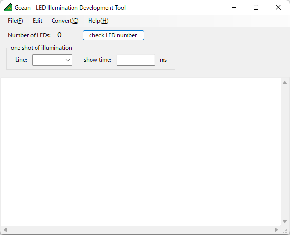
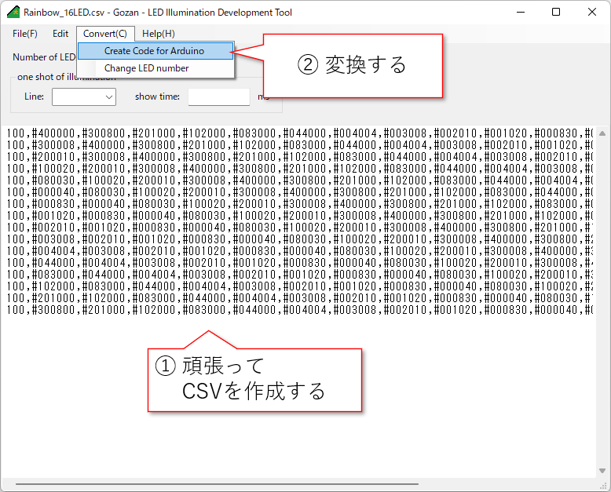
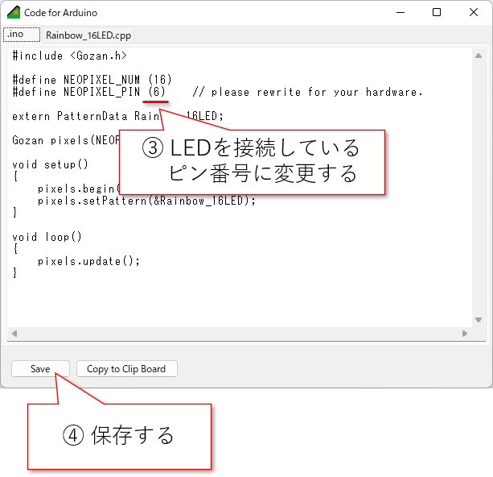

# Gozan

Gozanは、WS2812Bなどのシリアル通信でフルカラーLEDを制御できるLEDモジュール（adafruit社のNeoPixel等）をArduinoから制御する際に使用できる開発支援ツール・ライブラリ群です。

Gozanを用いたイルミネーション開発は下記の流れで行います：

 + 点灯パターンをPCで作成し、CSVファイルに記録・保存する（Gozan.exeの他、各種ソフトウェアや、ユーザー独自のスクリプト等を使用）

 + Gozan.exeを使用し、CSVファイルを基にArduinoのコードを変換・生成する

 点灯パターンは配列に格納されます

 + 変換したプロジェクトをひな型にArduino IDEでコーディング、コンパイル、書き込みを行う
 
 Gozanライブラリが導入されている必要があります。

 Arduinoでは、配列から点灯パターンを取り出して次から次へと再生されます。

## CSVファイルの仕様

CSVファイルには、1行にLEDの数分の発光させる色とその点灯時間を記載します。Arduino側ライブラリでは、一度に1行分を読み込んで点灯させ、指定時間が経過すると次の行を読み込むという処理を繰り返し行います。

１行の要素は、１列目がその行の点灯時間です。
２列目以降がLEDの発光色指定で、LEDが接続されている順番にLEDの数だけ記載します。

１列目がその行の点灯時間、２列目以降がLEDの発光色指定で、LEDが接続されている順番にLEDの数だけ記載します。時間の単位はミリ秒[ms]

発光色は「#」の後ろにRGBを16進数2桁ずつ6文字（#00000000～#FFFFFF）または1桁ずつ3文字（#000～#FFF）で記載してください。

## Arduino用Gozanライブラリ

内部で「Adafruit_NeoPixel.h」を使用していますので、そちらも導入してください

参考： https://github.com/adafruit/Adafruit_NeoPixel

## Gozanクラス 関数 リファレンス

+ void begin(void);
+ void show(void);
+ void clear(void);
+ void update(void);
+ bool isPlaying(void);
+ void setPattern(PatternData const *pattern_data, bool repeat = true);
+ void setPixelColor(uint16_t sequence);
