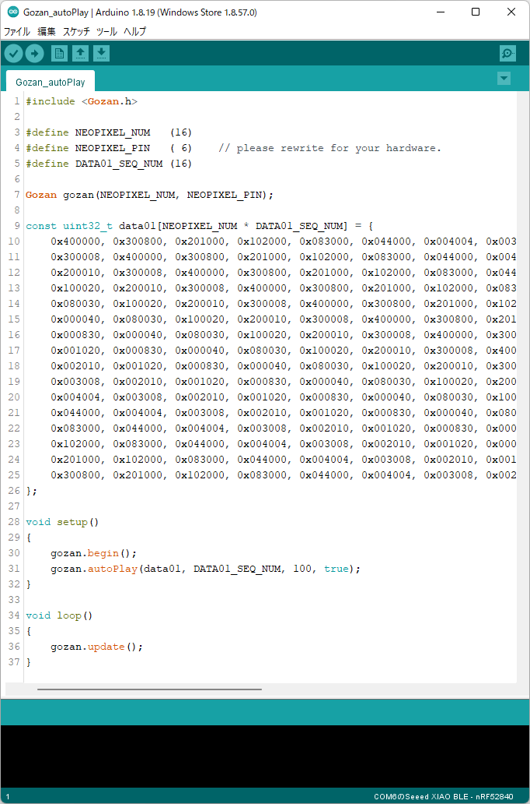

# Gozan

Gozanは、WS2812Bなどのシリアル通信でフルカラーLEDを制御できるLEDモジュール（adafruit社のNeoPixel等）をArduinoから制御する際に、
点灯パターンを配列に記載し、配列から読み込んで使うことを想定したライブラリです。

あらかじめLEDの点灯パターンを全て配列として用意することで、ソースコードの本体をシンプルなものにする（LED制御以外のロジックに集中できる）ようにすることをコンセプトにしています。

Gozanの実態は、Adafruit_NeoPixelライブラリのラッパです。
内部で「Adafruit_NeoPixel.h」を使用しています。

参考： https://github.com/adafruit/Adafruit_NeoPixel

## Gozanクラス 関数 リファレンス

+ void     begin(void);
+ void     show(void);
+ void     clear(void);
+ void     autoPlay(uint32_t const *data, uint32_t sequens_num, uint32_t one_shot_ms, bool repeat = true);
+ bool     isPlaying(void);
+ void     setPixelColor(uint32_t const *data, uint16_t sequence);
+ uint32_t getPixelColor(uint32_t const *data, uint16_t sequence, uint16_t led_no);
+ void     update(void);
